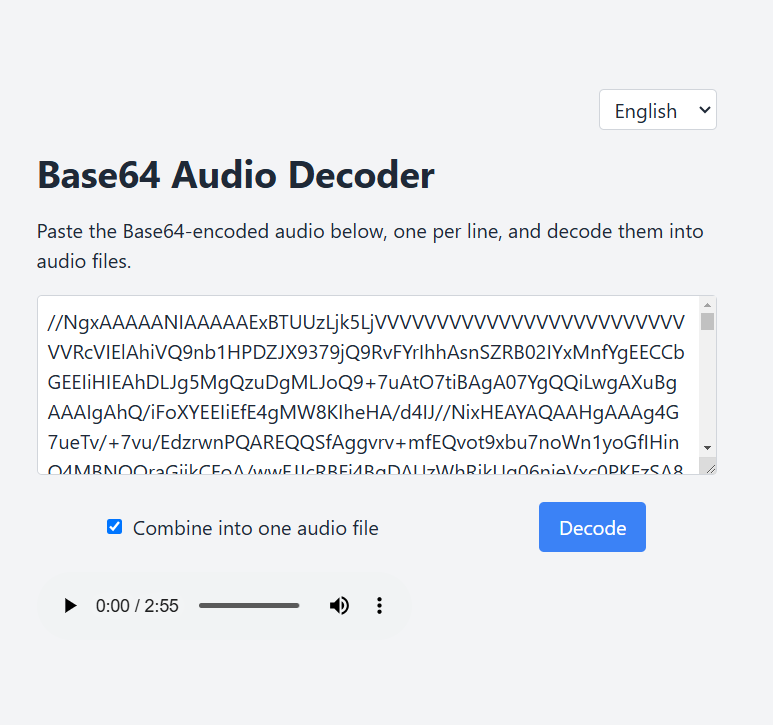

# Base64 Audio Decoder

## Descripción

La app permite decodificar archivos de audio codificados en Base64 y reproducirlosen el navegador. Se pueden pegar múltiples strings en Base64, una por línea, y la aplicación las decodificará en uno o varios archivos de audio.

## Características

- **Combinación de Audio**: Opción para combinar múltiples strings Base64 en un solo archivo de audio.
- **Multilenguaje**: inglés y español.

## Captura de Pantalla

